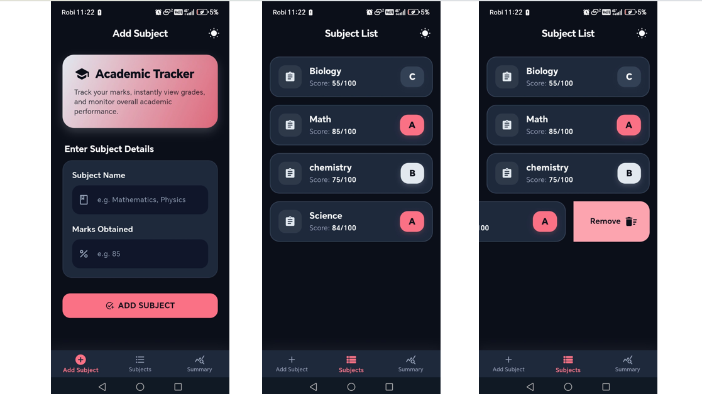
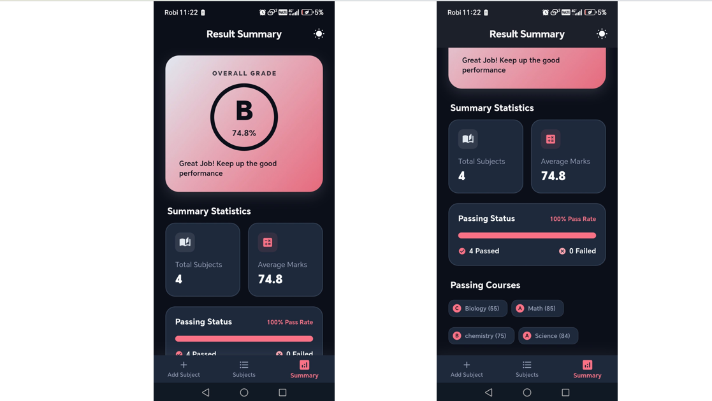

# Student Grade Tracker

A Flutter application designed for students to track their academic subjects and grades. The app features real-time performance analytics, an intuitive form-validation interface, and dynamic light/dark theme toggling, all designed around the **MVC (Model-View-Controller)** pattern.

---





## 🎨 Theme Customization & UI Design

The app incorporates a custom **Midnight Navy Slate & Sunset Coral-Pink** theme:
*   **Vibrant Aesthetics:** Moving away from standard primary colors, the app uses a rich slate-blue/navy tone for structural depth paired with a bright sunset-pink/coral for accents.
*   **Dynamic Theming:** Supports light and dark modes toggled directly in the `AppBar`.
*   **Theme Compliance:** All styling colors are dynamically resolved using `Theme.of(context)`. No colors are hardcoded inside individual widget classes.
*   **Frosted & Sleek Cards:** Modern rounded container borders and shadows provide a premium, clean visual dashboard.

---

## 🏗️ MVC Architecture

The application is structured using **Model-View-Controller** design patterns to enforce a strict separation of concerns and write maintainable, testable code:

*   **Model (`lib/models/subject.dart`):** Defines the `Subject` data structure. It encapsulates the core data attributes (including a private `_mark` field) and provides the business logic to calculate individual grades (`A`, `B`, `C`, or `F`).
*   **View (`lib/views/`):** Contains the stateless UI layouts (`MainNavigationScreen`, `AddSubjectScreen`, `SubjectListScreen`, `SummaryScreen`). These views render data by listening to the Controller and dispatching user actions to it.
*   **Controller (`lib/controllers/grade_tracker_controller.dart`):** Powered by `provider` and `ChangeNotifier`, the controller acts as the central state manager. It handles validation, input states, screen navigation indices, theme modes, list management, and performs real-time calculations (average mark, passing count, overall grade).

---

## ✨ Features Checklist

*   [x] **Three Screens Navigation:**
    *   **Add Subject Screen:** Form validates empty subject names and marks (must be an integer between 0 and 100). Includes a success SnackBar indicator.
    *   **Subject List Screen:** Lists all subjects with their names, scores, and colored grade badges inside a `ListView.builder`. Features smooth swipe-to-delete using `Dismissible` widgets.
    *   **Summary Screen:** Live-updating dashboard displaying total subjects, average mark, and overall grade inside custom progress indicators. It filters passing courses using `.where()` and lists them using `.map()`.
*   [x] **State Management & Architecture:**
    *   **Zero `setState` calls:** The app relies 100% on the state controller and `Provider` to handle updates, with every widget implemented as a `StatelessWidget`.
    *   **MVC separation:** Code is partitioned clearly between model, view, controller, and theme definitions.
*   [x] **List Actions & Streamlined Operations:**
    *   Demonstrates functional programming concepts (`.where()`, `.map()`, and `.fold()`) to aggregate scores, extract passing/failing subsets, and render widgets.
*   [x] **Custom Theme Toggle:**
    *   Supports live Light/Dark mode toggling from the AppBar, updating the entire application visual scheme immediately.

---

## 🚀 How to Run the App

### Prerequisites
*   [Flutter SDK](https://docs.flutter.dev/get-started/install) (v3.12.0 or newer recommended)
*   [Dart SDK](https://dart.dev/get-started)
*   An Android/iOS Emulator or Desktop/Chrome target device

### Installation Steps

1.  **Clone the repository:**
    ```bash
    git clone <repository-url>
    cd student_grade_tracker
    ```

2.  **Fetch project dependencies:**
    ```bash
    flutter pub get
    ```

3.  **Run the application:**
    ```bash
    flutter run
    ```

4.  **Build production version (Optional):**
    ```bash
    flutter build <platform>
    ```

---

## 📝 Grading Criteria & Implementation Details

*   **Subject Class:** The class implements a private `_mark` field and a public getter `mark` to read it, alongside a `grade` getter calculating:
    *   `A` if mark $\ge 80$
    *   `B` if mark $\ge 65$
    *   `C` if mark $\ge 50$
    *   `F` if mark $< 50$
*   **List Operations:** The controller uses `.where()` to calculate `passingSubjects` and `failingSubjects` collections. The `SummaryScreen` uses `.map()` to generate chip badges for passing subjects.
*   **Form Validation:** Subject names are checked for empty/whitespace-only input, and marks are validated to be integers between $0$ and $100$ using `TextFormField` validators.
*   **State Management:** State is initialized via `ChangeNotifierProvider` and accessed globally in views using `context.watch<GradeTrackerController>()` or `context.read<GradeTrackerController>()`.
